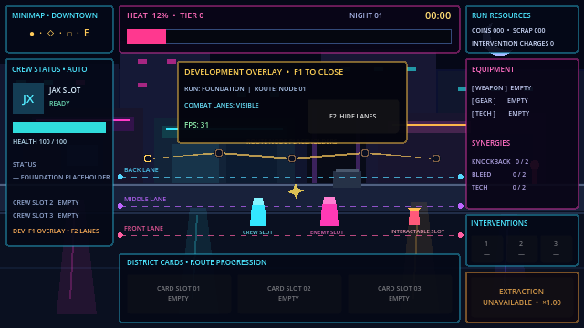

# Neon Loop

Neon Loop is a Godot 4.x pixel-art auto-brawler about shaping a crew, influencing automatic street fights, managing escalating risk, and deciding when to extract.

## Project status

**Milestone 0 — Project Foundation: complete**

The repository currently contains the verified technical foundation:

- 640 × 360 internal resolution with pixel-art-friendly scaling
- `GameRun` composition root
- Placeholder Downtown Loop nighttime stage
- Three toggleable development combat lanes and route markers
- Placeholder HUD and development debug overlay
- Typed, logic-free runtime system shells
- Architecture, implementation, testing, content, and decision documentation

Milestone 1 combat has not been implemented. See [IMPLEMENTATION_PLAN.md](IMPLEMENTATION_PLAN.md) for the next scoped task.

## Running the project

1. Install Godot 4.7 or a compatible Godot 4.x release.
2. Open `project.godot` in the Godot editor.
3. Run the project with <kbd>F5</kbd> or the editor's Run Project button.

The configured main scene opens directly into `GameRun`.

### Development controls

- <kbd>F1</kbd>: show or hide the debug overlay
- <kbd>F2</kbd>: show or hide the three debug combat lanes

## Documentation

- [GameSpecifications.md](GameSpecifications.md) — product source of truth
- [AGENTS.md](AGENTS.md) — repository rules and milestone gates
- [ARCHITECTURE.md](ARCHITECTURE.md) — scene and system ownership
- [IMPLEMENTATION_PLAN.md](IMPLEMENTATION_PLAN.md) — milestone status and next work
- [TEST_PLAN.md](TEST_PLAN.md) — verification history and planned coverage
- [CONTENT_CATALOG.md](CONTENT_CATALOG.md) — implemented and specified content
- [CHANGELOG.md](CHANGELOG.md) — project history
- [ADR 0001](docs/decisions/0001-run-engagement-escalation-and-randomness.md) — engagement, escalation, randomness, and validation decisions

## Development scope

The current implementation stops at Milestone 0. Combat, actors, enemies, targeting, rewards, coin clusters, Night Pressure, seeded random streams, equipment, cards, saving, shops, bosses, and procedural generation remain unimplemented.

Milestone 2 must not begin until Milestone 1 passes its technical acceptance criteria and the project owner records the required human validation gate.

## License

Project licensing is recorded in [LICENSE](LICENSE). The bundled Godot AI development addon retains its own MIT license under `addons/godot_ai/LICENSE`.
