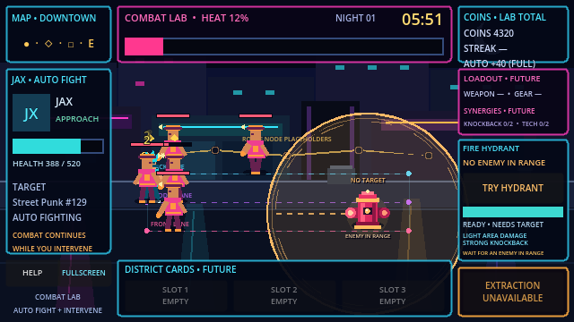

# Neon Loop

Neon Loop is a Godot 4.x pixel-art auto-brawler about shaping a crew, influencing automatic street fights, managing escalating risk, and deciding when to extract.

## Play online

Play the currently published Combat Lab build at **[ariesyous.github.io/projectneon](https://ariesyous.github.io/projectneon/)**.

The verified Milestone 2 changes described below are local to this repository branch and have not been published or redeployed. The public link remains the previously deployed Milestone 1 build until the project owner explicitly requests a new deployment.

Repository: [github.com/ariesyous/projectneon](https://github.com/ariesyous/projectneon)

## Project status

**Milestone 2 — Player Intervention: technically complete**

The repository currently contains the verified foundation, automatic-combat proof, and first player intervention:

- 640 × 360 internal resolution with pixel-art-friendly scaling
- `GameRun` composition root
- Downtown Loop nighttime Combat Lab with three movement lanes
- Resource-backed Jax and Street Punk actors
- Typed state, health, targeting, reservations, attack timing, damage, knockback, hit-stop, death, and repeat spawning
- Fixed-value coin clusters with generous clicking, full-value auto-collection, at-most-once accounting, and a manual streak bonus capped at 10%
- A visible Fire Hydrant with an exact range preview, deterministic area damage, strong knockback, authored cooldown, rejection feedback, and matching HUD state
- One combat-safe region shared by spawning, movement, reservations, knockback, recovery, replacement cleanup, and lane visualization
- Clearer click/tap coin feedback, nonmodal Help, Web sound unlock, visible fullscreen controls, and mobile-landscape guidance
- Enlarged live HUD and development diagnostics
- Forty-six deterministic tests with 694 assertions and no failures
- Architecture, implementation, testing, content, and decision documentation

The project owner recorded the five-person Milestone 1 Human Validation Gate as **PASSED** on 2026-07-18. That qualitative decision belongs to the owner and is distinct from automated and coding-agent verification. The separately executed technical Milestone 2 result is 46/46 tests plus a 315.3046-second combat-boundary soak; see [TEST_PLAN.md](TEST_PLAN.md) for the full evidence and limitations.

## Running the project

1. Install Godot 4.7 or a compatible Godot 4.x release.
2. Open `project.godot` in the Godot editor.
3. Run the project with <kbd>F5</kbd> or the editor's Run Project button.

The configured main scene opens directly into `GameRun`.

### Player controls

- Click or tap a coin cluster to collect it immediately and build a manual streak; ignoring it still grants the full base value
- Click or tap the Fire Hydrant while it is ready and a Street Punk is inside its preview circle
- Use the visible **Help** control to reopen the nonmodal Combat Lab guidance
- Use the visible **Fullscreen** control as the primary desktop/mobile presentation control; Escape exits fullscreen where supported

### Development controls

- <kbd>F1</kbd>: show or hide the debug overlay
- <kbd>F2</kbd>: show or hide the three debug combat lanes

<kbd>F11</kbd> requests fullscreen only when the platform delivers it to the game. Browsers that retain F11 continue to use their normal browser behavior.

## Documentation

- [GameSpecifications.md](GameSpecifications.md) — product source of truth
- [AGENTS.md](AGENTS.md) — repository rules and milestone gates
- [ARCHITECTURE.md](ARCHITECTURE.md) — scene and system ownership
- [IMPLEMENTATION_PLAN.md](IMPLEMENTATION_PLAN.md) — milestone status and next work
- [TEST_PLAN.md](TEST_PLAN.md) — verification history and planned coverage
- [CONTENT_CATALOG.md](CONTENT_CATALOG.md) — implemented and specified content
- [CHANGELOG.md](CHANGELOG.md) — project history
- [ADR 0001](docs/decisions/0001-run-engagement-escalation-and-randomness.md) — engagement, escalation, randomness, and validation decisions

## Development scope

The verified implementation stops after technical Milestone 2. It contains the Fire Hydrant intervention and the targeted Combat Lab presentation/usability improvements authorized after the owner's gate pass. The local Windows and Web verification builds have not been published or deployed.

Night Pressure, deterministic random streams, equipment, synergies, cards, extraction, shops, saving, bosses, progression, procedural generation, and all other Milestone 3+ behavior remain unimplemented and out of scope. Playtester interest in more enemies, weapons, abilities, combat systems, inspection, encounter/run structure, coin spending, customization, and progression is future design input rather than current functionality.

## License

Project licensing is recorded in [LICENSE](LICENSE). The bundled Godot AI development addon retains its own MIT license under `addons/godot_ai/LICENSE`.
