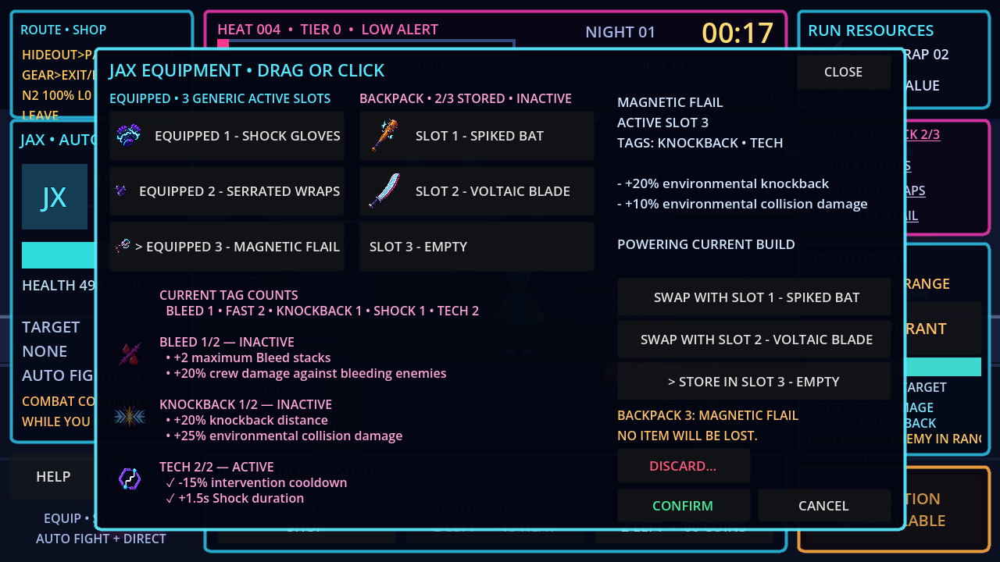
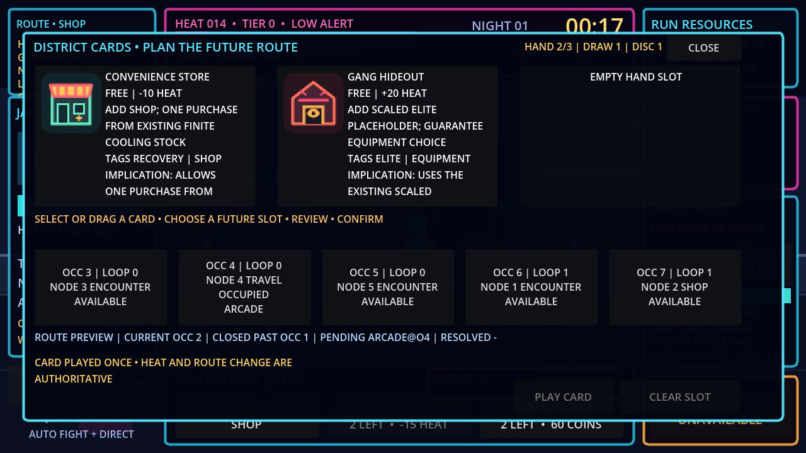

# Neon Loop

Neon Loop is a Godot 4.x pixel-art auto-brawler about shaping an automatic street fight, managing escalating risk, intervening at decisive moments, and deciding when to extract.

## Play online

Play the tentative Milestone 6 playtest build at **[ariesyous.github.io/projectneon](https://ariesyous.github.io/projectneon/)**. Playtesters and feedback curators should use the [Milestone 6 Playtest Guide](MILESTONE_6_PLAYTEST.md).

Milestone 5 was implemented in feature commit `7ac7fa0794e79cfc60781b84ce7181f61e16bf7f`, merged through [PR #4](https://github.com/ariesyous/projectneon/pull/4), and published from `main` at merge commit `da934897cbdee44cb4d1a44b25e91b458558bfbc`. [GitHub Pages run 29713282074](https://github.com/ariesyous/projectneon/actions/runs/29713282074) completed successfully. This records the actual release state without assigning a semantic version.

Milestone 6 was fast-forwarded to `main` through playtest-guide commit `a147f93`. [GitHub Pages run 29960250903](https://github.com/ariesyous/projectneon/actions/runs/29960250903) successfully exported and deployed the tentative playtest build on 2026-07-22.

Repository: [github.com/ariesyous/projectneon](https://github.com/ariesyous/projectneon)

## Project status

**Milestone 6 — Vertical-Slice Content and Presentation: tentatively complete; external playtesting and final owner acceptance remain**

The authorized local Milestone 6 implementation adds:

- Three selectable, mechanically distinct crew members with authored starters: Jax (`jax`), the high-knockback Brawler with Spiked Bat; Zoey (`zoey`), the fast Tech Fighter with reduced intervention cooldowns and Shock Gloves; and Rex (`rex`), the high-health, control-resistant Bruiser with elite/boss damage and Reinforced Jacket
- Three distinct basics—Street Punk (`street_punk`), Bat Thug (`bat_thug`), and ranged Bottle Thrower (`bottle_thrower`)—plus the armoured, charge-capable Viper Enforcer (`viper_enforcer`) elite
- The Viper (`the_viper`) boss with a three-hit combo, charge, one-shot two-enemy summon, warned area attack, 40%-health enrage, reduced knockback, bounded control locks, dedicated health/telegraph presentation, boss-music layer, and victory sequence
- Finished Fire Hydrant presentation over its preserved authority; tokenized Call Backup with two charges, a 30-second base cooldown, exactly two temporary allies, and a 12-second eligible-combat lifetime; and the preserved two-charge Subway Reroute contract that advances one authored non-boss route occurrence and removes 15 Heat without changing Night Pressure or threshold precedence
- A native 1280 x 720 vertical-slice overlay with crew selection, intervention state, boss bar/telegraphs, contextual nonmodal tutorials, combo/high-combo display, pause/settings, complete terminal summaries, and same-seed/new-seed/menu actions
- Replaceable actor visuals with clearer movement/attack/hit/death animation, deterministic combat effects and screen shake, generated district music plus a boss layer, and authored UI/combat/progression sound categories
- Version-1 settings and profile persistence at `user://neon_loop_profile_v1.json`, including safe missing/corrupt/future-version handling, atomic replacement, development-only reset, and no mid-run save or permanent statistical bonuses
- The exact bounded unlock path: any completed run unlocks Zoey; a completed run with an elite defeat unlocks existing Hacker Deck; extraction unlocks existing Gang Hideout; and victory unlocks Rex. Development/test access still exposes all three crew, all nine existing equipment entries, and all four existing cards
- Presentation-only combo tracking and measurement-only cadence records for 10–20-second ambient, 30–60-second strategic, and 120–180-second major-risk targets; coin clicks remain ambient and ignoring them preserves the full base reward
- The unchanged deterministic schema version 1 and the same seven named streams; Milestone 6 boss actions, summons, projectiles, interventions, tutorials, combo/cadence, audio synthesis, and screen shake add no unseeded gameplay randomness

Godot 4.7 passed the cumulative automated gate at **244/244 tests and 3,234 assertions with no failures or skips across 22 suites**. A configured headless boot opened `/GameRun` cleanly, and the Pages workflow successfully exported/deployed the Web build. A live smoke loaded the `Neon Loop` page with a visible 1280×720 canvas and an empty warning/error console. Representative Victory/Extraction and owner-facing manual validation, exact cadence conformance, real-input interactions, settings/save/restart checks, broader resolutions/devices, a fresh Windows export/runtime, and new visual evidence remain organized in the playtest guide. The cumulative harness's 48 ObjectDB and four resource-in-use shutdown diagnostics remain a cleanup-audit TODO; the configured boot did not reproduce them.

**Milestone 5 — District Cards remains the last fully accepted baseline; Milestone 6 is the tentative final playtest release.**

The accepted Milestone 5 baseline adds:

- Typed card/effect Resources and exactly four stable-ID, one-copy cards: Arcade, Convenience Store, Gang Hideout, and Subway Entrance; all display `FREE`
- A finite four-card deck, deterministic two-card opening hand, hand capacity three, discard pile, no reshuffle, and clean restart
- Five stable future-route slots with one revisioned card modification per occurrence, staged confirmation, exactly-once Heat, and reached-node resolution
- Arcade's non-recursive fight and one-step authored reward-quality increase; Convenience Store's single existing-stock purchase; Gang Hideout's scaled elite placeholder and guaranteed equipment; Subway Entrance's exact one-encounter skip
- Supplemental card rewards after eligible baseline non-elite encounters, with up to three remaining choices and **Skip / Keep Hand**, without replacing ordinary standard/equipment rewards or recursing
- Selection only through the isolated `cards` stream after stable-ID filtering/sorting, with same-seed replay and cosmetic/other-stream isolation
- Safe planning that pauses eligible time and Night Pressure, preserves extraction/boss precedence, and cannot reopen thresholds or clear/bypass a queued boss
- Native drag/drop plus mouse/touch threshold fallback, first-pointer ownership, right-click cancel, immediate invalid/outside return feedback, and complete click/tap/keyboard alternatives
- A contained native 1280 x 720 card hand, detail, route-slot, highlight, feedback, and pending/resolved minimap presentation alongside all preserved Milestone 0–4.2 systems

Godot 4.7 verification passed **188/188 tests and 2,450 assertions with no failures or skips across 15 suites**. This preserves all 145 Milestone 1–4.2 tests/1,709 assertions and adds 43 Milestone 5 tests/741 assertions. Fresh Windows and Web release exports completed successfully, the exported Windows runtime smoke exited 0, and the locally served Web build passed real pointer/click card flows at 1280 x 720 with an empty warning/error console. Evidence: `docs/screenshots/milestone_5_district_cards.png`.

The project owner recorded the separate five-person Milestone 1 Human Validation Gate as **PASSED** on 2026-07-18. That qualitative decision belongs to the owner and is distinct from automated and coding-agent verification.

The published Pages build was smoke-checked at its native 1280 x 720 presentation and produced no browser-console warnings or errors. The earlier Milestone 4–4.2 publication from `1b3d5a5118ad31d864266ec2aefd44e652ffafe9` remains a historical baseline and is superseded by the current Milestone 5 deployment.

## Running the project

1. Install Godot 4.7 or a compatible Godot 4.x release.
2. Open `project.godot` in the Godot editor.
3. Run the project with <kbd>F5</kbd> or the editor's Run Project button.

The configured main scene opens directly into `GameRun`; the Milestone 6 working tree presents its crew-selecting main menu inside that scene before a run begins.

### Player controls

- Click or tap a coin cluster to collect immediately and build a manual streak; ignoring it still grants the full base value
- Click/tap the intervention buttons or press <kbd>1</kbd>, <kbd>2</kbd>, or <kbd>3</kbd> for Fire Hydrant, Call Backup, or Subway Reroute; invalid, cooling-down, active, or exhausted requests leave authoritative state unchanged
- Use the visible run-action controls to claim rewards, spend finite shop cooling, continue, extract, and advance the boss trigger
- Use **PLAN CARDS** at a safe route-planning state, then click/tap or drag a hand card to one of the five future route slots; review and press **Confirm** before authority changes
- Right-click to cancel an active card drag; invalid or outside drops return the card to the hand without changing Heat, route state, piles, rewards, or deterministic streams
- Use **Skip / Keep Hand** to decline a card reward, including when the three-card hand is full
- Inspect or manage the three generic active equipment slots and one three-slot inactive backpack through the existing drag or click/tap/keyboard flows; destructive discard remains separately named and confirmed
- Press <kbd>Space</kbd> to pause or resume eligible run time
- Press <kbd>E</kbd> to confirm extraction while an extraction window is available
- Press <kbd>Tab</kbd> to show or hide build details
- Use the main-menu and pause settings panels for Master/Music/SFX volume, fullscreen/windowed mode, screen-shake intensity, damage numbers, hit-flash reduction, and pause-on-focus-loss
- At a terminal summary, choose same-seed restart, new-seed restart, or Return to Main Menu
- Use **Help** to reopen the nonmodal guidance
- Use **Fullscreen** as the primary desktop and mobile presentation control; Escape exits fullscreen where supported

Reward and run-action buttons respond to one ordinary click or tap.

### Development controls

- <kbd>F1</kbd>: show or hide the debug overlay
- <kbd>F2</kbd>: show or hide the three debug combat lanes

<kbd>F11</kbd> requests fullscreen only when the platform delivers it to the game. Browsers that retain F11 continue to use their normal browser behavior.

## Current scope

Milestone 6 Vertical-Slice Content and Presentation is the tentative final milestone. Its automated gate is green, and the owner has authorized publication of the build for external playtesting. The remaining manual, qualitative, browser/device, cadence, and outcome checks are organized in [MILESTONE_6_PLAYTEST.md](MILESTONE_6_PLAYTEST.md); they remain distinct from final owner acceptance. Milestone 5 District Cards remains the last fully accepted baseline from `main` merge commit `da934897cbdee44cb4d1a44b25e91b458558bfbc`.

Milestone 6 ends at the three-member crew, three-basic/one-elite/one-boss roster, three interventions, finished prototype presentation/audio/tutorial/settings/profile/summary layers, four bounded unlocks over existing content, fixed authored route, and complete victory/extraction/defeat paths. It adds no route generation, fifth card, tenth required equipment entry, permanent stat bonus, or broad progression tree.

Stop after Milestone 6. There are no planned future milestones. Additional districts/cards/crew/enemies/bosses; procedural routes; multiplayer; controller support; localization; achievements; daily-run systems; leaderboards; advanced meta-progression; permanent stat trees; mid-run saving/replays; equipment selling, salvage, rarity, uniques, affixes, or sets; a card currency/shop/economy; and every other post-vertical-slice system remain out of scope. Publication for Milestone 6 playtesting does not authorize expansion.

### Working-tree provenance

- The tracked, enabled Godot-AI addon carries a pre-existing owner update to 3.0.5 across 17 addon files. It remains development tooling and is not Milestone 6 gameplay work.
- The pre-existing owner deletions of `window/stretch/aspect="keep"` and `textures/default_filters/use_nearest_mipmap_filter=false` remain preserved in `project.godot`; they are not Milestone 6 changes.
- The Milestone 6 `SaveService` and `AppState` Autoload entries are separate authorized application/profile additions. They own no active-run Heat, Night Pressure, outcome, or random stream.

## Documentation

- [GameSpecifications.md](GameSpecifications.md) — product source of truth
- [AGENTS.md](AGENTS.md) — repository rules, verified scope, and milestone gates
- [ARCHITECTURE.md](ARCHITECTURE.md) — scene and system ownership
- [IMPLEMENTATION_PLAN.md](IMPLEMENTATION_PLAN.md) — milestone status and next work
- [TEST_PLAN.md](TEST_PLAN.md) — verification history and planned coverage
- [MILESTONE_6_PLAYTEST.md](MILESTONE_6_PLAYTEST.md) — non-leading tester prompt, curator matrix, and feedback template
- [CONTENT_CATALOG.md](CONTENT_CATALOG.md) — implemented and specified content
- [CHANGELOG.md](CHANGELOG.md) — project history
- [ADR 0001](docs/decisions/0001-run-engagement-escalation-and-randomness.md) — engagement, escalation, randomness, and validation decisions

## License

Project licensing is recorded in [LICENSE](LICENSE). The bundled Godot AI development addon retains its own MIT license under `addons/godot_ai/LICENSE`.
