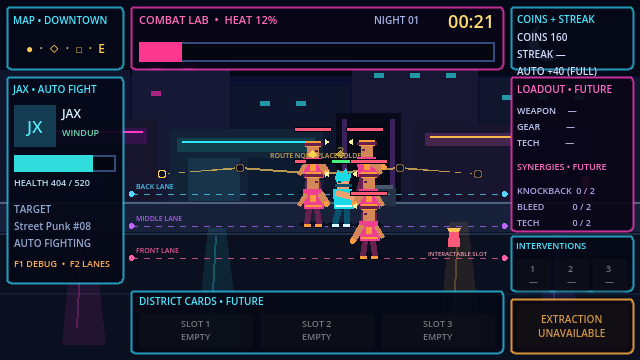

# Neon Loop

Neon Loop is a Godot 4.x pixel-art auto-brawler about shaping a crew, influencing automatic street fights, managing escalating risk, and deciding when to extract.

## Play online

Play the current Combat Lab build at **[ariesyous.github.io/projectneon](https://ariesyous.github.io/projectneon/)**.

Repository: [github.com/ariesyous/projectneon](https://github.com/ariesyous/projectneon)

## Project status

**Milestone 1 — Combat Lab: technically complete; owner Human Validation Gate pending**

The repository currently contains the verified foundation and automatic-combat proof:

- 640 × 360 internal resolution with pixel-art-friendly scaling
- `GameRun` composition root
- Downtown Loop nighttime Combat Lab with three movement lanes
- Resource-backed Jax and Street Punk actors
- Typed state, health, targeting, reservations, attack timing, damage, knockback, hit-stop, death, and repeat spawning
- Fixed-value coin clusters with generous clicking, full-value auto-collection, at-most-once accounting, and a manual streak bonus capped at 10%
- Enlarged live HUD and development diagnostics
- Thirty deterministic combat and reward tests
- Architecture, implementation, testing, content, and decision documentation

Milestone 2 remains blocked until the project owner records the required five-person Human Validation Gate. See [IMPLEMENTATION_PLAN.md](IMPLEMENTATION_PLAN.md) for the current scope and gate.

## Running the project

1. Install Godot 4.7 or a compatible Godot 4.x release.
2. Open `project.godot` in the Godot editor.
3. Run the project with <kbd>F5</kbd> or the editor's Run Project button.

The configured main scene opens directly into `GameRun`.

### Development controls

- Left click a coin cluster to collect it immediately; ignoring it still grants the full base value
- <kbd>F1</kbd>: show or hide the debug overlay
- <kbd>F2</kbd>: show or hide the three debug combat lanes

## Documentation

- [GameSpecifications.md](GameSpecifications.md) — product source of truth
- [AGENTS.md](AGENTS.md) — repository rules and milestone gates
- [ARCHITECTURE.md](ARCHITECTURE.md) — scene and system ownership
- [IMPLEMENTATION_PLAN.md](IMPLEMENTATION_PLAN.md) — milestone status and next work
- [TEST_PLAN.md](TEST_PLAN.md) — verification history and planned coverage
- [CONTENT_CATALOG.md](CONTENT_CATALOG.md) — implemented and specified content
- [CHANGELOG.md](CHANGELOG.md) — project history
- [ADR 0001](docs/decisions/0001-run-engagement-escalation-and-randomness.md) — engagement, escalation, randomness, and validation decisions

## Development scope

The current implementation stops after technical Milestone 1. Fire Hydrant behavior, Night Pressure runtime, deterministic random streams, equipment, synergies, cards, extraction, shops, saving, bosses, progression, and procedural generation remain unimplemented.

Milestone 2 must not begin until Milestone 1 passes its technical acceptance criteria and the project owner records the required human validation gate.

## License

Project licensing is recorded in [LICENSE](LICENSE). The bundled Godot AI development addon retains its own MIT license under `addons/godot_ai/LICENSE`.
