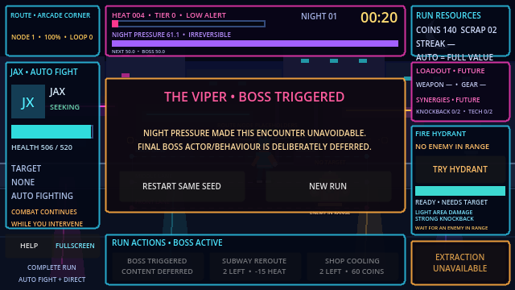

# Neon Loop

Neon Loop is a Godot 4.x pixel-art auto-brawler about shaping an automatic street fight, managing escalating risk, intervening at decisive moments, and deciding when to extract.

## Play online

Play the technically verified Milestone 3 build at **[ariesyous.github.io/projectneon](https://ariesyous.github.io/projectneon/)**.

The public build is deployed from `main` at commit `725cd373e2732b0dd6967a24a16e717e21ef8487`.

Repository: [github.com/ariesyous/projectneon](https://github.com/ariesyous/projectneon)

## Project status

**Milestone 3 — Complete Run Structure: technically complete**

The current build includes:

- A complete explicit run lifecycle from initialization through patrol, encounters, rewards, extraction, defeat, boss triggering, summary, and clean restart
- Tactical Heat with exact tiers and finite player-facing cooling
- Irreversible Night Pressure driven only by eligible active time and exactly-once encounter completion
- Data-driven enemy health, damage, and deterministic spawn-budget scaling
- Latched extraction windows, an unavoidable queued boss threshold, and safe transition-boundary handling
- Two finite Subway Reroute charges and two finite shop-cooling purchases per run
- One authoritative integer run seed with optional supplied seeds
- Seven isolated run-scoped deterministic streams: `encounters`, `spawns`, `rewards`, `equipment`, `cards`, `enemy_variants`, and `cosmetic`
- Stable candidate ordering, same-seed reproduction support, and cosmetic-stream isolation
- Standard reward choices, authoritative coin and scrap accounting, run summaries, and same-seed or new-seed restart
- Resource-backed Jax and Street Punk automatic combat with typed state, targeting, reservations, damage, knockback, hit-stop, effects, death, and cleanup
- Full-value automatic coin collection, optional manual streak bonuses, and at-most-once accounting
- The Fire Hydrant intervention with authoritative range, damage, knockback, rejection, and cooldown behavior
- Help, Web sound unlock, fullscreen handling, mobile-landscape guidance, and development diagnostics

Godot 4.7 verification passed **75/75 tests and 1,100 assertions with no failures or skips**. This preserves all 46 Milestone 1–2 tests and adds 29 Milestone 3 tests. Representative extraction, defeat, boss-threshold, cooling, pause/modal, same-seed, cosmetic-isolation, and clean-restart paths were also exercised in Windows and Web builds.

The project owner recorded the separate five-person Milestone 1 Human Validation Gate as **PASSED** on 2026-07-18. That qualitative decision belongs to the owner and is distinct from automated and coding-agent verification.

## Running the project

1. Install Godot 4.7 or a compatible Godot 4.x release.
2. Open `project.godot` in the Godot editor.
3. Run the project with <kbd>F5</kbd> or the editor's Run Project button.

The configured main scene opens directly into `GameRun`.

### Player controls

- Click or tap a coin cluster to collect immediately and build a manual streak; ignoring it still grants the full base value
- Click or tap the Fire Hydrant when it is ready and a Street Punk is inside its preview circle
- Use the visible run-action controls to claim rewards, spend finite Subway or shop cooling, continue, extract, and advance the boss trigger
- Press <kbd>Space</kbd> to pause or resume eligible run time
- Press <kbd>E</kbd> to confirm extraction while an extraction window is available
- Use **Help** to reopen the nonmodal guidance
- Use **Fullscreen** as the primary desktop and mobile presentation control; Escape exits fullscreen where supported

Reward and run-action buttons respond to one ordinary click or tap.

### Development controls

- <kbd>F1</kbd>: show or hide the debug overlay
- <kbd>F2</kbd>: show or hide the three debug combat lanes

<kbd>F11</kbd> requests fullscreen only when the platform delivers it to the game. Browsers that retain F11 continue to use their normal browser behavior.

## Current scope

Milestone 3 is complete. Its boss scope intentionally ends at threshold latching, safe queueing, `BOSS_INTRO`, and `BOSS_ACTIVE`; final boss content belongs to a later milestone.

**Milestone 4 — Equipment and Synergies is the next authorized development scope, but it is not implemented yet.** It will add the nine-item equipment catalogue, three generic slots, equipment rewards and UI, deterministic tag/modifier aggregation, and the Knockback, Bleed, and Tech synergies with activation and alternative-path previews.

Milestone 5 District Cards, Milestone 6 content/presentation, final boss content, broader progression and persistence, procedural generation, and other deferred systems remain out of scope until separately authorized.

## Documentation

- [GameSpecifications.md](GameSpecifications.md) — product source of truth
- [AGENTS.md](AGENTS.md) — repository rules, verified scope, and milestone gates
- [ARCHITECTURE.md](ARCHITECTURE.md) — scene and system ownership
- [IMPLEMENTATION_PLAN.md](IMPLEMENTATION_PLAN.md) — milestone status and next work
- [TEST_PLAN.md](TEST_PLAN.md) — verification history and planned coverage
- [CONTENT_CATALOG.md](CONTENT_CATALOG.md) — implemented and specified content
- [CHANGELOG.md](CHANGELOG.md) — project history
- [ADR 0001](docs/decisions/0001-run-engagement-escalation-and-randomness.md) — engagement, escalation, randomness, and validation decisions

## License

Project licensing is recorded in [LICENSE](LICENSE). The bundled Godot AI development addon retains its own MIT license under `addons/godot_ai/LICENSE`.
