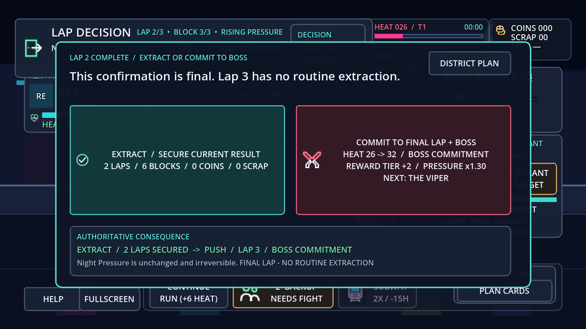

# Neon Loop

Neon Loop is a Godot 4.x pixel-art auto-brawler about shaping an automatic street fight, managing escalating risk, intervening at decisive moments, and deciding when to extract.

## Play online

Play the current WP02 browser-playtest build at **[ariesyous.github.io/projectneon](https://ariesyous.github.io/projectneon/)**. The owner authorized the technically evidenced WP02 boundary for `main` and GitHub Pages publication on 2026-08-21; the separate five-person comprehension gate remains pending.

Milestone 5 was implemented in feature commit `7ac7fa0794e79cfc60781b84ce7181f61e16bf7f`, merged through [PR #4](https://github.com/ariesyous/projectneon/pull/4), and published from `main` at merge commit `da934897cbdee44cb4d1a44b25e91b458558bfbc`. [GitHub Pages run 29713282074](https://github.com/ariesyous/projectneon/actions/runs/29713282074) completed successfully. This records the actual release state without assigning a semantic version.

Milestone 6 was fast-forwarded to `main` through playtest-guide commit `a147f93`. [GitHub Pages run 29960250903](https://github.com/ariesyous/projectneon/actions/runs/29960250903) successfully exported and deployed the tentative playtest build on 2026-07-22.

Repository: [github.com/ariesyous/projectneon](https://github.com/ariesyous/projectneon)

## Project status

**WP02 — Core Run Loop and State Clarity: technical/runtime/visual gate passed; owner five-person comprehension gate pending**

The local WP02 working tree adds:

- An authoritative three-lap/three-block lifecycle with stable lap/block IDs, explicit PLAN → BLOCK/FIGHT → REWARD rhythm, Extract/Push after laps one and two, and an unmistakable second-Push commitment to lap three and The Viper
- Exact-once lap-decision tokens, +6 Heat per Push, per-lap Pressure/reward/modifier data, stale/replay rejection, lifecycle summaries, and synchronous restart/menu cleanup without UI-owned progression
- All three crew available on fresh production access snapshots while preserving serialized version-1 Zoey/Rex history; Hacker Deck and Gang Hideout remain breadth unlocks
- Phase, next-event/countdown, current-action, shop, lap-decision, boss, extraction, and result presentation using the WP01 visual language; the Milestone 5 planner remains functional until WP03
- Measurement-only 10–20-second ambient, 45–90-second complete-block, and 120–180-second lap-decision bands; schema 1 and all seven deterministic streams remain unchanged

The preserved Milestone 6 content baseline supplies:

- Three selectable, mechanically distinct crew members with authored starters: Jax (`jax`), the high-knockback Brawler with Spiked Bat; Zoey (`zoey`), the fast Tech Fighter with reduced intervention cooldowns and Shock Gloves; and Rex (`rex`), the high-health, control-resistant Bruiser with elite/boss damage and Reinforced Jacket
- Three distinct basics—Street Punk (`street_punk`), Bat Thug (`bat_thug`), and ranged Bottle Thrower (`bottle_thrower`)—plus the armoured, charge-capable Viper Enforcer (`viper_enforcer`) elite
- The Viper (`the_viper`) boss with a three-hit combo, charge, one-shot two-enemy summon, warned area attack, 40%-health enrage, reduced knockback, bounded control locks, dedicated health/telegraph presentation, boss-music layer, and victory sequence
- Finished Fire Hydrant presentation over its preserved authority; tokenized Call Backup with two charges, a 30-second base cooldown, exactly two temporary allies, and a 12-second eligible-combat lifetime; and the preserved two-charge Subway Reroute contract that advances one authored non-boss route occurrence and removes 15 Heat without changing Night Pressure or threshold precedence
- A native 1280 x 720 vertical-slice overlay with crew selection, intervention state, boss bar/telegraphs, contextual nonmodal tutorials, combo/high-combo display, pause/settings, complete terminal summaries, and same-seed/new-seed/menu actions
- Replaceable actor visuals with clearer movement/attack/hit/death animation, deterministic combat effects and screen shake, generated district music plus a boss layer, and authored UI/combat/progression sound categories
- Version-1 settings and profile persistence at `user://neon_loop_profile_v1.json`, including safe missing/corrupt/future-version handling, atomic replacement, development-only reset, and no mid-run save or permanent statistical bonuses
- The historical version-1 unlock record: any completed run unlocked Zoey and victory unlocked Rex in M6; WP02 retires those access grants while preserving their facts. Elite defeat → Hacker Deck and extraction → Gang Hideout remain active breadth rules
- Presentation-only combo tracking and the historical M6 cadence record; WP02 supersedes only the active complete-block band as described above. Coin clicks remain ambient and ignoring them preserves the full base reward
- The unchanged deterministic schema version 1 and the same seven named streams; Milestone 6 boss actions, summons, projectiles, interventions, tutorials, combo/cadence, audio synthesis, and screen shake add no unseeded gameplay randomness

Godot 4.7.2 passed the current cumulative gate at **264/264 tests and 3,646 assertions with no failures or skips across 25 suites**. A fixed-seed ordinary composed trace reaches both lap decisions inside the 120–180-second band and a boss result at 599.883 eligible seconds. Configured `/GameRun`, twelve inspected native/safe-area/Web-scale captures, Windows/Web release exports, the exported Windows runtime, and native/2560×1440 local production-Web pointer/console checks passed. The cumulative harness still emits the pre-existing post-success 48 ObjectDB/four-resource shutdown diagnostic; focused, affected, configured, long-form, export/runtime, and browser runs do not reproduce it. The owner five-person WP02 comprehension check remains pending.

**Milestone 5 remains the last fully owner-accepted historical baseline; WP02 is the current browser-playtest candidate, with its owner comprehension gate still pending.**

The accepted Milestone 5 baseline adds:

- Typed card/effect Resources and exactly four stable-ID, one-copy cards: Arcade, Convenience Store, Gang Hideout, and Subway Entrance; all display `FREE`
- A finite four-card deck, deterministic two-card opening hand, hand capacity three, discard pile, no reshuffle, and clean restart
- Five stable future-route slots with one revisioned card modification per occurrence, staged confirmation, exactly-once Heat, and reached-node resolution
- Arcade's non-recursive fight and one-step authored reward-quality increase; Convenience Store's single existing-stock purchase; Gang Hideout's scaled elite placeholder and guaranteed equipment; Subway Entrance's exact one-encounter skip
- Supplemental card rewards after eligible baseline non-elite encounters, with up to three remaining choices and **Skip / Keep Hand**, without replacing ordinary standard/equipment rewards or recursing
- Selection only through the isolated `cards` stream after stable-ID filtering/sorting, with same-seed replay and cosmetic/other-stream isolation
- Safe planning that pauses eligible time and Night Pressure, preserves extraction/boss precedence, and cannot reopen thresholds or clear/bypass a queued boss
- Native drag/drop plus mouse/touch threshold fallback, first-pointer ownership, right-click cancel, immediate invalid/outside return feedback, and complete click/tap/keyboard alternatives
- A contained native 1280 x 720 card hand, detail, route-slot, highlight, feedback, and pending/resolved minimap presentation alongside all preserved Milestone 0–4.2 systems

Godot 4.7 verification passed **188/188 tests and 2,450 assertions with no failures or skips across 15 suites**. This preserves all 145 Milestone 1–4.2 tests/1,709 assertions and adds 43 Milestone 5 tests/741 assertions. Fresh Windows and Web release exports completed successfully, the exported Windows runtime smoke exited 0, and the locally served Web build passed real pointer/click card flows at 1280 x 720 with an empty warning/error console. Evidence: `docs/screenshots/milestone_5_district_cards.png`.

The project owner recorded the separate five-person Milestone 1 Human Validation Gate as **PASSED** on 2026-07-18. That qualitative decision belongs to the owner and is distinct from automated and coding-agent verification.

The published Pages build was smoke-checked at its native 1280 x 720 presentation and produced no browser-console warnings or errors. The earlier Milestone 4–4.2 publication from `1b3d5a5118ad31d864266ec2aefd44e652ffafe9` remains a historical baseline and is superseded by the current Milestone 5 deployment.

## Running the project

1. Install Godot 4.7 or a compatible Godot 4.x release.
2. Open `project.godot` in the Godot editor.
3. Run the project with <kbd>F5</kbd> or the editor's Run Project button.

The configured main scene opens directly into `GameRun`; the current working tree presents all three crew before the first gameplay draw and then enters the WP02 district loop.

### Player controls

- Click or tap a coin cluster to collect immediately and build a manual streak; ignoring it still grants the full base value
- Click/tap the intervention buttons or press <kbd>1</kbd>, <kbd>2</kbd>, or <kbd>3</kbd> for Fire Hydrant, Call Backup, or Subway Reroute; invalid, cooling-down, active, or exhausted requests leave authoritative state unchanged
- Use the visible run-action controls to claim rewards, spend finite shop cooling, continue, extract, and advance the boss trigger
- Use **PLAN CARDS** at a safe route-planning state, then click/tap or drag a hand card to one of the five future route slots; review and press **Confirm** before authority changes
- Right-click to cancel an active card drag; invalid or outside drops return the card to the hand without changing Heat, route state, piles, rewards, or deterministic streams
- Use **Skip / Keep Hand** to decline a card reward, including when the three-card hand is full
- Inspect or manage the three generic active equipment slots and one three-slot inactive backpack through the existing drag or click/tap/keyboard flows; destructive discard remains separately named and confirmed
- Press <kbd>Space</kbd> to pause or resume eligible run time
- Press <kbd>E</kbd> to confirm extraction while a lap decision is available; the shortcut forwards the same exact decision token as the visible control
- Press <kbd>Tab</kbd> to show or hide build details
- Use the main-menu and pause settings panels for Master/Music/SFX volume, fullscreen/windowed mode, screen-shake intensity, damage numbers, hit-flash reduction, and pause-on-focus-loss
- At a terminal summary, choose same-seed restart, new-seed restart, or Return to Main Menu
- Use **Help** to reopen the nonmodal guidance
- Use **Fullscreen** as the primary desktop and mobile presentation control; Escape exits fullscreen where supported

Reward and run-action buttons respond to one ordinary click or tap.

### Development controls

- <kbd>F1</kbd>: show or hide the debug overlay
- <kbd>F2</kbd>: show or hide the three debug combat lanes

<kbd>F11</kbd> requests fullscreen only when the platform delivers it to the game. Browsers that retain F11 continue to use their normal browser behavior.

## Current scope

WP02 Core Run Loop and State Clarity is the current runtime and browser-playtest boundary. Its technical/runtime/visual gate is green, but its owner-run five-person comprehension gate remains pending in [the WP02 evidence template](docs/product/WP02_UNBRIEFED_COMPREHENSION_CHECK.md). The owner separately authorized the WP02 `main`/Pages release on 2026-08-21; publication does not constitute qualitative acceptance or downstream authorization. Milestone 5 District Cards remains the last fully owner-accepted baseline from `main` merge commit `da934897cbdee44cb4d1a44b25e91b458558bfbc`.

The preserved content boundary remains the three-member crew, three-basic/one-elite/one-boss roster, existing interventions, prototype presentation/audio/tutorial/settings/profile/summary layers, fixed authored route, and complete victory/extraction/defeat paths. WP02 restructures lifecycle, crew access, and state clarity only; it adds no breadth content, route generation, fifth card, tenth equipment entry, permanent stat bonus, or broad progression tree.

There is no Milestone 7. The owner-approved roadmap uses WP01–WP07; WP01 and WP02 have landed only under separate explicit tasks. WP03 is unstarted and not authorized by this result. Additional districts/cards/crew/enemies/bosses; procedural routes; multiplayer; controller support; localization; achievements; daily-run systems; leaderboards; advanced meta-progression; permanent stat trees; mid-run saving/replays; equipment selling, salvage, rarity, uniques, affixes, or sets; a card currency/shop/economy; and every other undocumented expansion remain out of scope.

### Working-tree provenance

- The tracked, enabled Godot-AI addon carries a pre-existing owner update to 3.0.5 across 17 addon files. It remains development tooling and is not Milestone 6 gameplay work.
- The pre-existing owner deletions of `window/stretch/aspect="keep"` and `textures/default_filters/use_nearest_mipmap_filter=false` remain preserved in `project.godot`; they are not Milestone 6 changes.
- The Milestone 6 `SaveService` and `AppState` Autoload entries are separate authorized application/profile additions. They own no active-run Heat, Night Pressure, outcome, or random stream.

## Documentation

- [GameSpecifications.md](GameSpecifications.md) — product source of truth
- [AGENTS.md](AGENTS.md) — repository rules, verified scope, and milestone gates
- [ARCHITECTURE.md](ARCHITECTURE.md) — scene and system ownership
- [IMPLEMENTATION_PLAN.md](IMPLEMENTATION_PLAN.md) — milestone status and next work
- [TEST_PLAN.md](TEST_PLAN.md) — verification history and planned coverage
- [WP02 acceptance evidence](docs/product/WP02_ACCEPTANCE_EVIDENCE.md) — current technical/runtime/visual gate and remaining owner check
- [WP02 authority map](docs/product/WP02_CURRENT_TO_TARGET_AUTHORITY_MAP.md) — bounded lifecycle/profile migration and preserved contracts
- [MILESTONE_6_PLAYTEST.md](MILESTONE_6_PLAYTEST.md) — non-leading tester prompt, curator matrix, and feedback template
- [CONTENT_CATALOG.md](CONTENT_CATALOG.md) — implemented and specified content
- [CHANGELOG.md](CHANGELOG.md) — project history
- [ADR 0001](docs/decisions/0001-run-engagement-escalation-and-randomness.md) — engagement, escalation, randomness, and validation decisions

## License

Project licensing is recorded in [LICENSE](LICENSE). The bundled Godot AI development addon retains its own MIT license under `addons/godot_ai/LICENSE`.
