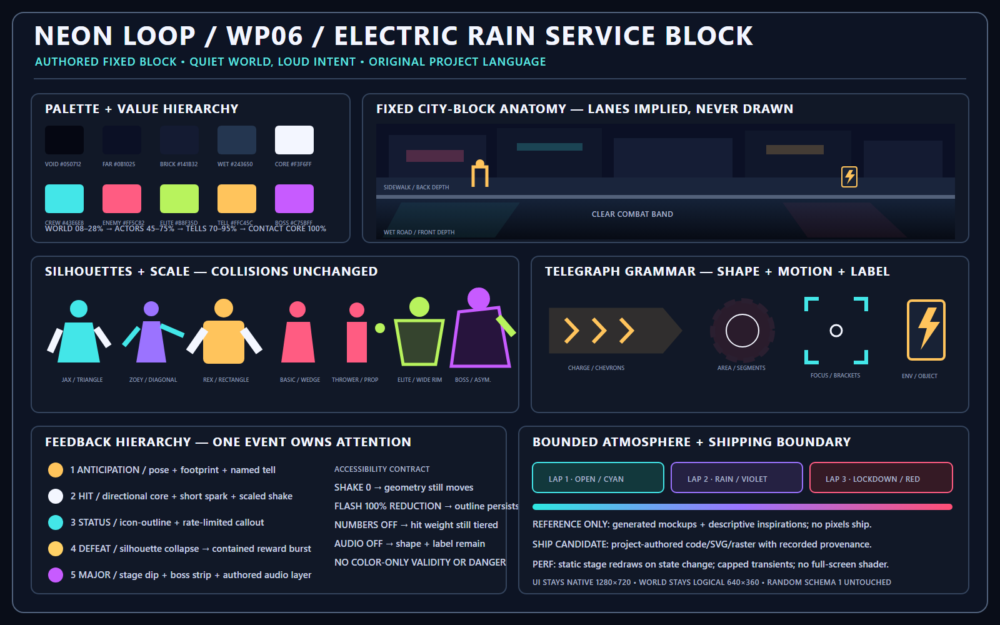

# WP06 Art Direction — Electric Rain Service Block

Status: **owner-approved, implemented, and accepted for publication on 2026-08-30**
Prepared: 2026-08-26
Runtime boundary: finalized WP05 at `37ebc9d872f2fd4972e5ac5cc621148c00f0d649`; branch `codex/wp-06-world-combat-polish`

## Decision in one sentence

Keep Neon Loop's fixed 640×360 combat geometry and native 1280×720 interface, but replace the visible debug arena with one original, code-native neon service block whose curb, storefronts, lighting, occlusion, and props imply the three logical lanes; then give anticipation, contact, status, defeat/reward, and major events five distinct accessible feedback signatures.

Source: [`wp06_art_direction_sheet.svg`](wp06_art_direction_sheet.svg). The PNG is a deterministic review render of that exact-text source.

## Why this is the smallest coherent direction

- The authoritative combat space, lane centers, targeting, spawns, route occurrences, state graph, and camera framing already work. WP06 does not need a new map or camera system.
- The current stage is one static code-drawn backdrop plus separate route/lane marker nodes. Replacing the backdrop vocabulary and release visibility is lower risk than adding a tilemap, procedural city, dynamic-light stack, or shader pipeline.
- Existing actors are code-drawn and already observe state, facing, health, Focus, Bleed, Shock, and hit-flash settings. Variant-specific silhouettes can be added in that owner without touching hitboxes, attacks, AI, or timing.
- Existing feedback is already event-driven and presentation-only. The hierarchy can be implemented by routing resolved events into distinct visual/audio treatments, not by changing damage or combat authority.
- Existing UI hierarchy is strong. WP06 needs purposeful state entrances/exits and world integration, not a second interface redesign.

## Current-state audit

### Release-visible world communication

- `downtown_loop.tscn` still contains literal `ROUTE NODE PLACEHOLDERS`, `BACK LANE`, `MIDDLE LANE`, and `FRONT LANE` labels.
- `RouteMarkers` draws the route polyline and five circular nodes in every composed stage view. Its presentation is not release-gated.
- `DebugLaneMarkers` draws dashed lane lines, endpoint dots, and the combat-space rectangle. The debug overlay itself is release-gated, but stage marker visibility defaults on and is separately owned.
- `DowntownBackdrop` identifies itself as Milestone 0 placeholder art. Its flat storefront rectangles and broad colored bands communicate systems more like a diagram than a place.
- Spawn `Marker2D` nodes are logically harmless and not drawn, but the visible route/lane treatment makes their invisible placement feel like part of an exposed debug arena.

### Actor and threat readability

- All nine actor variants share one torso/legs/head construction. Palette changes and one prop distinguish most variants, so Jax/Zoey/Rex and the basic roster read more as recolors than role silhouettes.
- The Viper is only a 1.16 scale of the same base construction. Elite and boss outlines exist, but mass, posture, and asymmetry are not yet strong enough for peak-density recognition.
- Every live intent currently uses one generic warning circle/crosshair/label. Charge, area, ranged, summon, Environment footprint, target marker, and Focus therefore compete through closely related rings.
- Actor health, target diamond, Focus ring, facing marker, Bleed stack, and Shock arc are individually useful but can stack tightly above a 48–72-pixel actor.

### Contact, status, reward, and major feedback

- Light and heavy contact currently share one eight-ray spark family, differentiated mainly by size/color, damage number punctuation, sound, and shake.
- `CombatFeedback` caps live sparks/numbers at 48, which is a useful performance boundary to retain.
- Build/status acknowledgements are already rate-limited and presentation-only, but their central callout can overlap actor intent during encounter entry.
- Coin clusters are readable and generous, but their permanent world copy adds to the label load; the authored object should carry more of the meaning, with countdown copy appearing only while actionable.
- Boss, tutorial, combo, PLAN, reward, shop, lap decision, and result surfaces mostly change through immediate `visible` flips. The phase banner alone performs a short alpha change.

### Audio and accessibility

- The current catalogue has the required stable district/boss loops and SFX IDs, generated once as deterministic 22,050 Hz mono PCM. There is one district loop, one boss layer, and eight SFX voices.
- Screen shake is deterministic and scales from 0 to 1. Damage numbers can be disabled. Hit flash can be reduced to zero duration. Master/Music/SFX buses and focus-loss pause are already owned correctly.
- Shape plus text already reinforces major validity and danger. WP06 must preserve this when reducing labels and must remain readable with shake off, flash fully reduced, numbers off, or audio muted.

### Performance risks to control

- Every `ActorVisual` queues a redraw every frame. Hydrant and Power Box redraw every active presentation frame; coin clusters and telegraphs redraw while live.
- Sparks and damage numbers instantiate per event, although the 48-transient cap prevents unbounded growth.
- The current static backdrop redraws only when requested and uses no full-screen shader or dynamic light nodes. The replacement should preserve that inexpensive shape.
- WP06 should not add per-frame scene-tree searches, dynamic shadow casting, full-screen bloom, unbounded particles, or cosmetic gameplay-stream draws.

## Visual language

### Palette

| Role | Color | Use |
| --- | --- | --- |
| Void | `#050712` | Deep sky, alley interiors, separation behind silhouettes |
| Far architecture | `#0B1025` | Skyline and upper facade |
| Brick/steel | `#141B32` | Main authored structure |
| Wet reflection | `#243650` | Low-saturation pavement highlights |
| Contact core | `#F3F6FF` | One-frame impact center and highest-value text |
| Crew | `#43E6E8` | Crew edge/readability family; individual crew retain identity accents |
| Basic enemy | `#FF5C82` | Ordinary threat family |
| Elite | `#B8F35D` | Elite mass/rim and Viper hazard accents |
| Anticipation | `#FFC45C` | Charge lanes, interruptible tells, valid Environment footprint |
| Boss | `#C75BFF` | Boss silhouette/rim and major-event accent |
| Critical hazard | `#FF415F` | Segmented boss area boundary; never used alone |

World architecture stays between roughly 8% and 28% perceived value. Actors occupy 45–75%, telegraphs and interactables 70–95%, and the contact core briefly reaches 100%. Saturated color belongs to actors, actionable objects, and event edges rather than every window and road stripe.

### Stage anatomy and depth

The fixed screen is divided by authored geometry, not explanatory lines:

1. **Far facade:** dark upper stories, fire escapes, windows, original signs, distant warm rooms.
2. **Sidewalk/back depth:** storefront thresholds, recessed doors, bollards, wall utilities, curb shadows.
3. **Clear combat band:** the existing actor-origin rectangle remains unchanged and mostly free of props.
4. **Wet road/front depth:** broad reflection breaks, drains, foreground curb/rail fragments, occasional low occluders outside the safe actor area.
5. **Entrances:** alley mouth, arcade doors, convenience glazing, subway stair, and hideout shutter use shape/light to explain where threats arrive. Spawn markers remain invisible internal nodes.

The three authoritative lane Y positions remain exactly internal. Pavement seams, foot placement, shadows, occlusion, and perspective imply depth without exposing lane names, dashes, dots, or endpoints.

### Materials, lighting, and signage

- **Materials:** wet asphalt, painted brick, corrugated shutter steel, grimy glass, insulated conduit, subway tile, neon acrylic, warning paint.
- **Lighting:** cool ambient night; two or three restrained practical pools; wet reflections broken into short vertical clusters; no full-screen glow wash.
- **Signage:** original fictional location signs only—Arcade, Convenience, Subway, and abstract Viper chevrons. No real brands, logos, slogans, or copied facade designs.
- **UI/world separation:** native UI remains crisp and screen-space. World text appears only for an active named tell, hover/focus interaction, or short result; the world never repeats complete UI explanations.

## Character scale and silhouette grammar

Actor collision/hurtbox sizes and gameplay origins remain unchanged.

| Actor | Silhouette target |
| --- | --- |
| Jax | Forward inverted triangle, short powerful arms, compact striking pose |
| Zoey | Narrow diagonal body, extended gauntlet/lightning arm, fastest cadence |
| Rex | Broad rectangle/trapezoid, low center of gravity, heavy planted hook |
| Street Punk | Lean hood/wedge, short jab profile |
| Bat Thug | Stocky torso plus unmistakable long diagonal bat |
| Bottle Thrower | Narrow body plus elevated bottle/throwing arm and ranged lean |
| Viper Enforcer | Wide shoulders, armored forearms, acid outer rim, larger planted feet |
| The Viper | Taller asymmetric coat/shoulder shape, one dominant striking arm, magenta/acid rim |
| Backup Runner | Compact crew-blue runner silhouette, visually secondary to permanent crew |

Ordinary actors stay in the existing 48–72 logical-pixel band. The boss may extend visually to roughly 78–84 pixels without changing its origin, collisions, targeting, or attack geometry.

## Telegraph grammar

| Relationship | Shape | Motion/timing expression | Text |
| --- | --- | --- | --- |
| Charge | Long ground corridor with repeated inward chevrons and hard leading edge | Chevrons advance toward impact during the existing authored windup | One attack label |
| Area | Segmented radial boundary with closing inner ring | Segments contract/fill during the existing timer | One attack label plus countdown |
| Bottle/ranged | Attacker pose plus narrow target/landing relationship | One dashed travel cue or landing bracket, not a full arena ring | Named `BOTTLE THROW` |
| Summon | Two doorway/entry brackets | Entrance practicals pulse; no fake damage area | Named `SUMMON VIPERS` |
| Focus | Cyan-white corner brackets around exactly one priority target | Brackets settle/hold for the accepted Focus duration | Target + intent remains in HUD |
| Environment | Authored object silhouette plus segmented footprint | Object-specific pulse; Hydrant flow or Power Box conduit travels to affected cluster | Object/action name remains in HUD |
| Current target | Small amber diamond/direction cue | Static or low-amplitude pulse | No extra prose |

Focus, target selection, Environment footprint, and enemy threat may never use the same boundary shape.

## Feedback hierarchy

1. **Anticipation/telegraph:** pose, authored footprint, direction, one named cue, and existing windup timing.
2. **Hit/contact:** directional white core, one short material-colored spark, existing hit-stop, category-scaled shake, and optional number.
3. **Status/proc:** persistent small icon/outline at the actor plus one rate-limited icon-and-label build acknowledgement.
4. **Defeat/reward:** readable silhouette collapse/dissolve, contained coin/equipment burst, then an attract/settle motion that does not mask threats.
5. **Boss/major event:** brief stage value dip, dedicated boss strip, authored facade/practical change, and existing boss music layer.

When two levels coincide, the higher level owns amplitude and the lower one reduces clutter. A boss area tell must not be hidden by proc confetti; a reward burst must not obscure a still-live threat.

## Bounded block and lap variation

No procedural generation and no new content entry are proposed.

### Existing-context block profiles

- **Alley / ordinary:** fire escape, dumpster, hydrant, service door, cool cyan practical.
- **Arcade:** glass cabinets/marquee, magenta spill, integrated Power Box/conduit.
- **Convenience Store:** warm awning, bright glass rectangle, finite-stock/recovery calm.
- **Subway Entrance:** tile stair, amber wayfinding, ventilation haze, no-combat quiet.
- **Viper Signal/Showdown:** shutters, barriers, abstract Viper chevrons, Power Box, emergency practicals.

These are deterministic presentation profiles selected from the already-authoritative current block/encounter context. They add no route choice, gameplay effect, content ID, or random draw.

### Lap atmosphere

- **Lap 1 — Open:** cyan/amber, sparse reflections, ordinary storefront life.
- **Lap 2 — Rain:** violet fill, denser wet reflection, one acid Viper sign/rim, slightly more steam.
- **Lap 3 — Lockdown:** shutters/barriers, emergency red practicals, darker facade, boss magenta/acid accents.

Escalation changes presentation only. It does not alter visibility radius, collision, spawn location, targeting, damage, timing, or rewards.

## Phase transition language

All motion fits inside the already-authoritative state. Presentation never advances or delays gameplay authority.

| Phase | Intentional entrance/exit |
| --- | --- |
| PLAN | Street value dips; a horizontal shutter/scan edge resolves into the focused two-choice panel; location facade remains recognizable at the margins. |
| FIGHT | Panel releases; entrance practical/door and existing arrival countdown identify the threat source; combat floor returns to full value. |
| REWARD | Last defeat collapses into a contained reward burst; world cools/dims while the existing exact consequence panel gains focus. |
| SHOP | Convenience practical warms, combat noise recedes, and finite-stock choice lifts over a calm street. |
| PUSH/EXTRACT | Curb/reflection direction separates safe exit from deeper district; final commitment uses locked chevrons plus text, never color alone. |
| BOSS | Existing 2.5-second intro owns the screen: storefront practicals cut, barricade/emergency lights engage, boss layer enters, then The Viper silhouette resolves. |
| RESULT | Existing terminal/victory timing resolves into outcome color/shape, decisive build highlight, and progressively disclosed summary. |

Motion targets reuse WP01's 0.10/0.18/0.28-second presentation tokens unless an existing authored transition already owns a longer duration.

## Accessibility invariants

- **Shake 0:** contact still has directional core, pose reaction, and sound/shape.
- **Hit-flash reduction 1.0:** actor outline/material spark remains; no white-body dependency.
- **Damage numbers off:** light/heavy/environment/boss weight remains distinguishable through shape, scale, material, hit-stop, and optional audio.
- **Audio muted:** every important cue retains shape, label, meter, and state text.
- **Color:** validity and danger also use boundary style, chevrons/segments/brackets, silhouette, and text.
- **Focus pause:** unchanged `RunDirector` ownership and safe-boundary behavior.

## Performance budget

- One static code-native stage layer redraws only on context/lap/phase changes.
- No dynamic lights, real-time shadows, full-screen shader, post-process bloom, or per-pixel rain simulation.
- Preserve the current maximum of 48 live feedback transients; add lower per-category caps if peak review requires them.
- Reuse or pool only after profiling shows measurable value; no premature gameplay-object pooling rewrite.
- New atmosphere animation uses a bounded handful of deterministic strips/pulses and no gameplay random stream.
- Peak-density validation will measure default and fully reduced accessibility variants on the configured 30-ordinary-enemy ceiling plus boss/add representative fixtures.

## Reference inspiration versus shippable assets

### Reference-only

- The five generated `wp06_after_*.png` images in [`mockups/`](mockups/) are visual targets only. Their pixels, rendered UI text, invented facade details, and any accidental control/layout drift will **not** be imported into the game.
- Existing before captures are historical/current evidence only.
- Descriptive inspiration is limited to classic side-view arcade-brawler staging, rainy late-night service streets, transit/utility wayfinding, and industrial hazard-marking grammar. No external reference image file is stored in the repository and no third-party pixels are traced or copied.

### Eligible to ship after approval and review

- Original project-authored GDScript drawing, Godot scenes, SVG icons/signs, generated or hand-authored raster assets created specifically for Neon Loop, and retuned existing generated-audio definitions.
- Every raster candidate will receive a stable source/provenance entry and remain replaceable presentation data.
- Established WP01 SVG/UI systems remain code-native; they will not be rasterized from the mockups.

## Implemented boundary

The accepted implementation is limited to:

- fixed-stage presentation and release/debug visibility;
- code-drawn actor silhouettes/poses without hitbox or timing changes;
- presentation-only combat feedback, telegraphs, world interactable copy, generated-audio mix/tuning, and phase transitions;
- deterministic context/lap presentation snapshots wired from existing authorities;
- presentation/layout/performance tests and the complete visual/platform evidence matrix;
- canonical architecture/plan/test/catalog/changelog/roadmap/WP06 evidence updates after facts exist.

It will not change damage, health, AI, target selection, attack selection, windup/active/recovery/cooldown values, intervention effects, reward/economy, progression, card/inventory/save authority, stable IDs, tokens/revisions, random streams/schema, or the isolated Milestone 5 compatibility boundary.

## Approval record

The owner approved this direction for implementation and, after final review, stated on 2026-08-30 that WP06 is good to go and should be published. That later statement authorizes the isolated WP06 commit/push/Pages publication. It does not authorize copied mockup pixels, content expansion, gameplay authority changes, or WP07.
