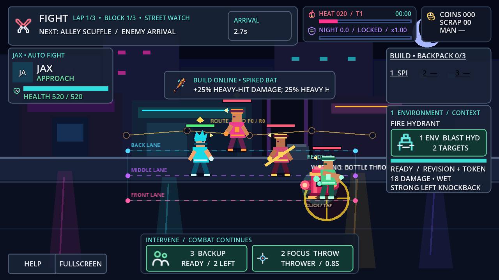
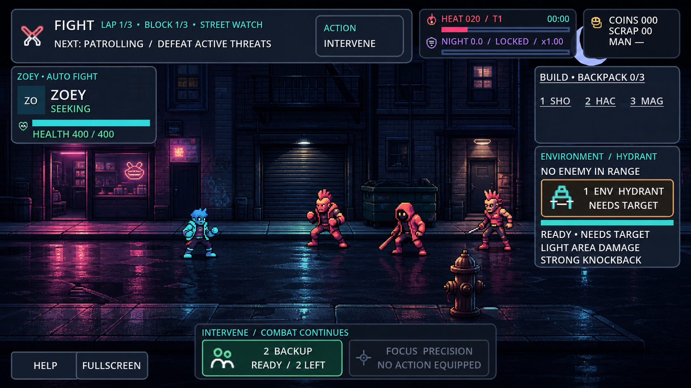
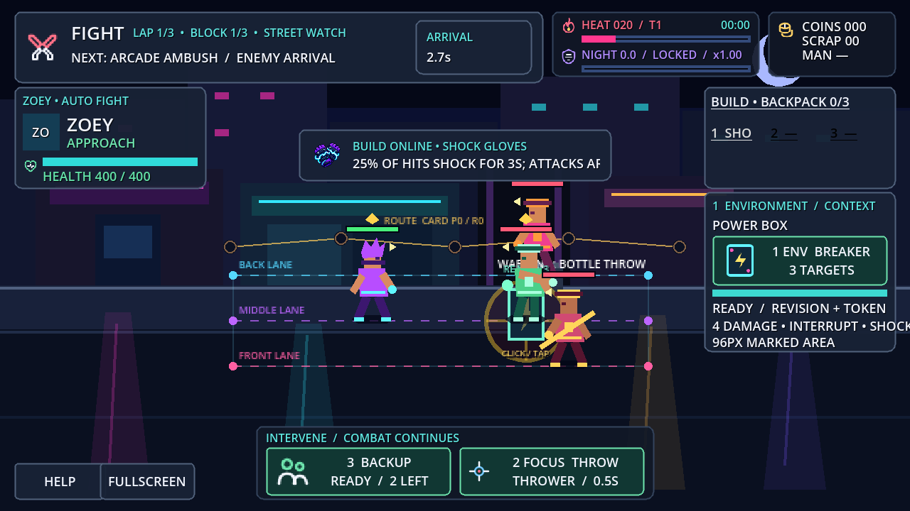
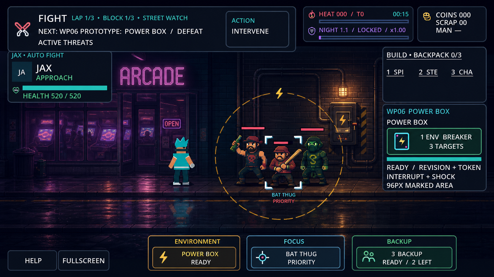
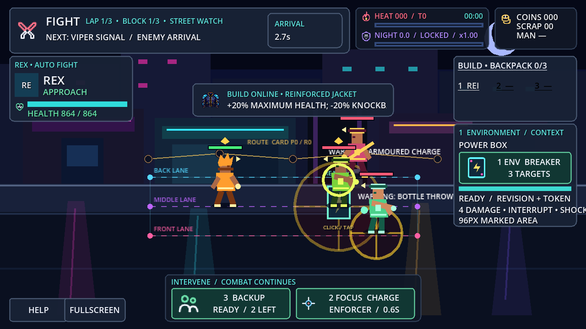
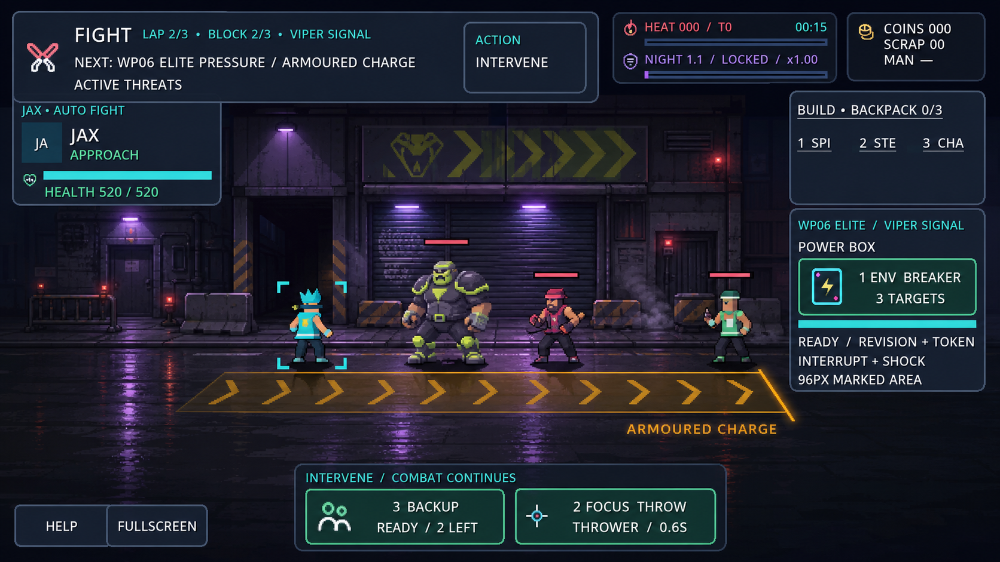
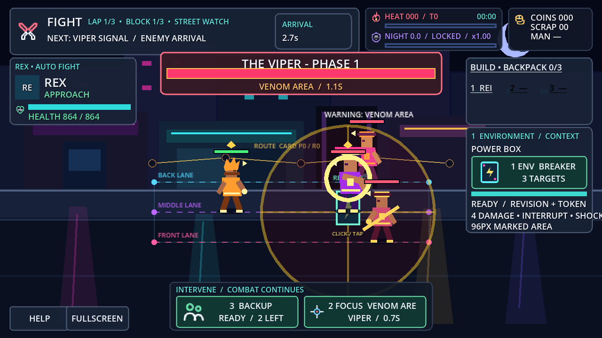
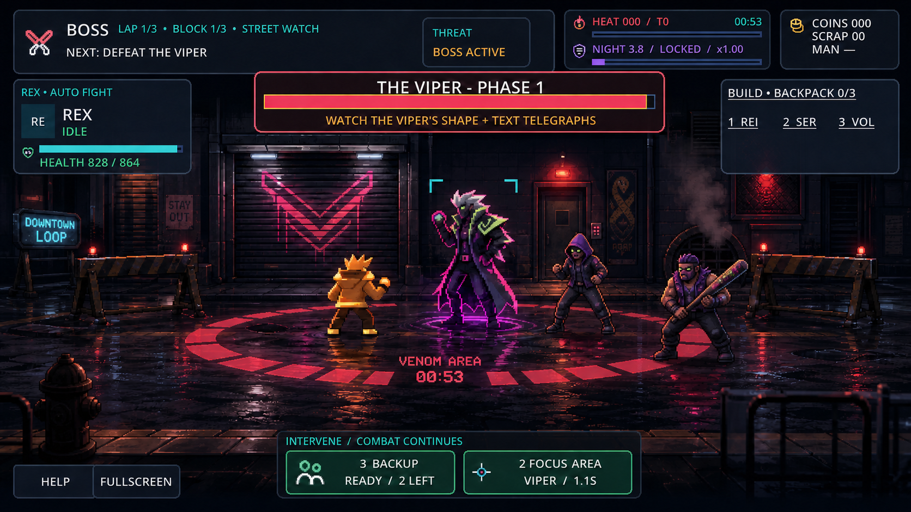
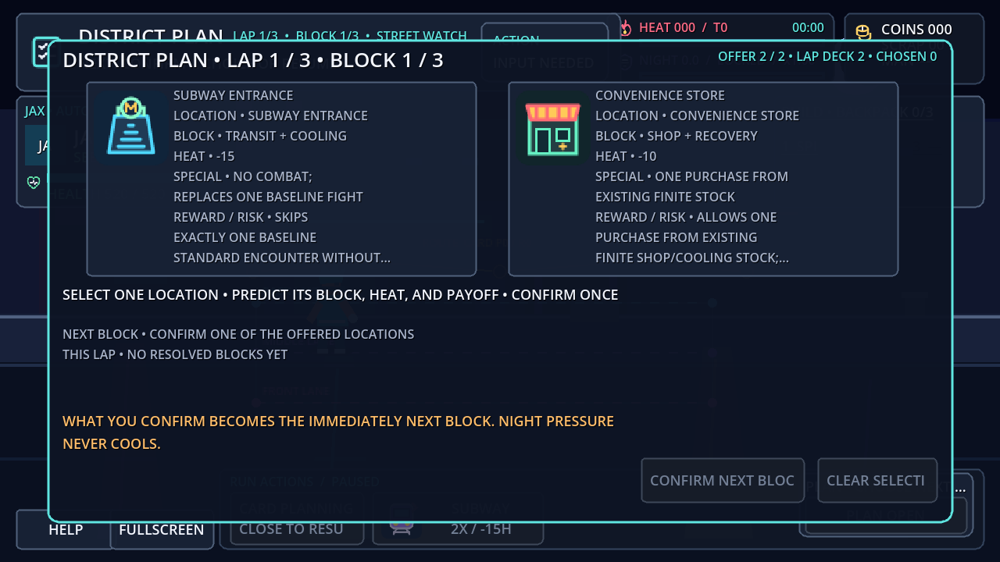
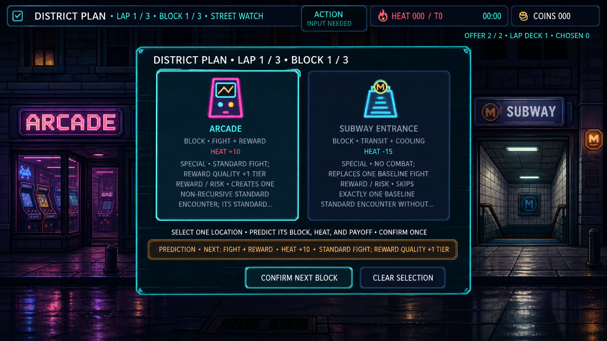

# WP06 Phase A — Art-Direction Approval Packet

Status: **approved and implemented; owner accepted publication on 2026-08-30**
Direction: [Electric Rain Service Block](WP06_ART_DIRECTION.md)

## Approval request

Approve the smallest coherent direction as one package:

1. Preserve the fixed 640×360 world, native 1280×720 UI, camera, combat bounds, and invisible three-lane authority.
2. Replace release-visible lane/route/debug communication with original curb, storefront, entrance, lighting, occlusion, and wet-pavement depth cues.
3. Use five deterministic context profiles—Alley, Arcade, Convenience, Subway, and Viper—plus three presentation-only lap atmospheres.
4. Strengthen variant silhouettes without changing actor origins, hitboxes, timing, AI, or stats.
5. Implement the five-level accessible feedback hierarchy and distinct charge/area/ranged/summon/Focus/Environment shapes.
6. Give PLAN, FIGHT, REWARD, SHOP, PUSH/EXTRACT, BOSS, and RESULT intentional presentation transitions within existing authoritative states.

Approval does not authorize mockup pixels as shipping assets, content expansion, balance changes, WP07, commit, push, or publication.

## Representative current/target comparisons

The left column is rendered from the current WP05 composition by [`capture_wp06_phase_a_baseline.gd`](../../../tests/visual/capture_wp06_phase_a_baseline.gd). The right column is a reference-only ImageGen keyframe. Generated copy/layout drift is not an implementation instruction; the art-direction document and current gameplay contracts are authoritative.

### Ordinary combat

| Current WP05 composition | Direction target — reference only |
| --- | --- |
|  |  |

Target read: early-lap alley, clear central combat band, authored curb/storefront/door/dumpster/hydrant depth, distinct crew/basic silhouettes, no lane or route markers.

### Power Box and Focus

| Current WP05 composition | Direction target — reference only |
| --- | --- |
|  |  |

Target read: Power Box is part of an Arcade service wall; its segmented footprint and conduit communicate Environment while cyan corner brackets communicate Focus on one live intent.

### Elite pressure

| Current WP05 composition | Direction target — reference only |
| --- | --- |
|  |  |

Target read: late-lap Viper loading frontage, wide acid-rim Enforcer, subordinate basics, and a long amber chevron corridor for Armoured Charge.

### Boss

| Current WP05 composition | Direction target — reference only |
| --- | --- |
|  |  |

Target read: lockdown stage practicals, taller asymmetric Viper, segmented inward-closing Venom Area boundary, separate Focus brackets, and a boss health strip that owns the major-event layer.

### Noncombat PLAN

| Current WP05 composition | Direction target — reference only |
| --- | --- |
|  |  |

Target read: the fixed street remains recognizable as the offered locations at the modal margins; the focused two-choice authority is unchanged; no route/lane debug surface leaks through the dim layer.

## What the comparison is approving

- **Approve:** value hierarchy, city-block depth, palette relationships, material vocabulary, silhouette differences, telegraph shapes, context profiles, lap atmosphere escalation, and UI/world separation.
- **Do not treat literally:** generated exact actor costume details, facade pixel layouts, UI copy, mockup item abbreviations, mockup encounter timing, or any visual element that conflicts with the current repository authority.
- **Implementation medium:** code-native Godot drawing/scenes and established SVG systems first. Raster assets are optional, replaceable, and individually provenance-recorded only where they materially improve the approved result.

## Phase A evidence

- Git boundary confirmed at `a744b665c0eccca117919bfc0561679945793690` before branching.
- Requested branch created: `codex/wp-06-world-combat-polish`.
- Owner-carried work re-audited as 75 addon paths—53 modified and 22 untracked—plus the Autoload-order-only `project.godot` diff. No other pre-existing dirty path exists.
- Five current-state captures rendered with Godot 4.7.2: `WP06_PHASE_A_BASELINE=PASS captures=5 authority_changes=0`.
- The first fixture run exposed one fixture-only bad accessor; it was corrected. The final rerun was clean apart from the expected helper registration line.
- No production gameplay, scene, Resource, project setting, save, random schema, stable ID, token/revision, or external state changed.
- Built-in ImageGen produced the five reference-only after keyframes. Exact prompts and source/output provenance are recorded in [IMAGEGEN_PROVENANCE.md](IMAGEGEN_PROVENANCE.md).

## Phase A resolution

The owner approved the bounded direction, and WP06 implemented the stage, actor, feedback, audio, transition, test, capture, and documentation work described here. On 2026-08-30 the owner accepted the result and authorized publication. WP07 remains unauthorized.
